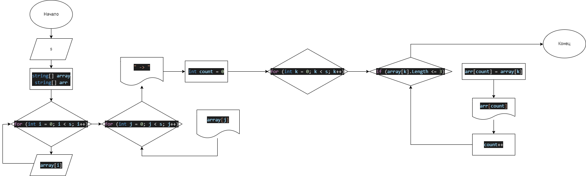

# Итоговая проверочная работа.

1. Создать репозиторий на GitHub
2. Нарисовать блок-схему алгоритма(можно обойтись блок-схемой основной содержательной части, если Вы выделяете её в отдельный метод)
3. Снабдить репозиторий оформленным текстовым описанием решения (файл Readme.md)
4. Написать программу, решающую поставленную задачу
5. Использовть контроль версий в работе над этим небольшим проектом (не должно быть так, что всё залито одним коммитом, как минимум этапы 2, 3 и 4 должны быть расположены в разных коммитах)
***

**Задача:** Написать программу, которая из имеющегося массива строк формирует массив из строк, длина которых меньше либо равна 3 символам. Первоначальный массив можно ввести с клавиатуры, либо задать на старте выполнения алгоритма. При решении не рекомендуется пользоваться коллекциями, лучше обойтись исключительно массивами.

**Примеры:**

["hello", "2", "world", ":-)"] -> [ "2", ":-)" ]
["1234", "1567", "-2", "computer science"] -> [ "-2" ]
["Russia", "Denmark", "Kazan"] -> []
***

## Решение

* В начале просим пользователя ввести желаемое количество элементов массива
* Создаём два строковых массива с ранее заданными пользователем размерами: первый - для заполнения пользователем, второй - для выполнения поставленной задачи
* Запускаем метод (функцию), в котором пользователю предлагается ввести элементы вручную
* Следом запускаем метод, выводящий первый массив в терминале
* Вводим стрелку, указывающую на массив-результат выполнения задания
* Запускаем метод, в котором создаётся переменная (*count*) для подсчёта элементов, соответствующих условию задания и определяющую размер нового массива. В нём же заполняем новый массив соответствующими элементами, параллельно выводя его в терминале и увеличивая переменную *count*
***
## Схема

